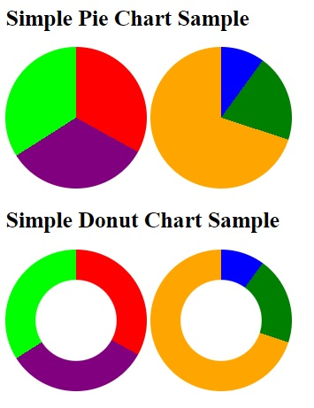

***SIMPLE PIE CHART v1.0***



**Get started**

Create HTML element with 'piechart' class with several elements with 'part' class inside

Attribute 'data-percent' for value : 40 for 40%

Attribute 'data-color' for color : red or  #ff0000 or rgba(255,0,0)

Obviously, sum of data-percent attributes of parts must be 100

```html
<div class="piechart">
    <div class="part" data-percent="40" data-color="rgba(255,0,0)"></div>
    <div class="part" data-percent="60" data-color="blue"></div>     
</div>
```

**Include CSS**

You can customize the css file (default pie diameter : 200px)

```html
<link rel="stylesheet" href="piechart.css">
```

**Include JS**

```html
<script src="piechart.js"></script>
```

**or jQuery version (jquery required before the script)**

```html
<script src="piechart.jquery.js"></script>
```